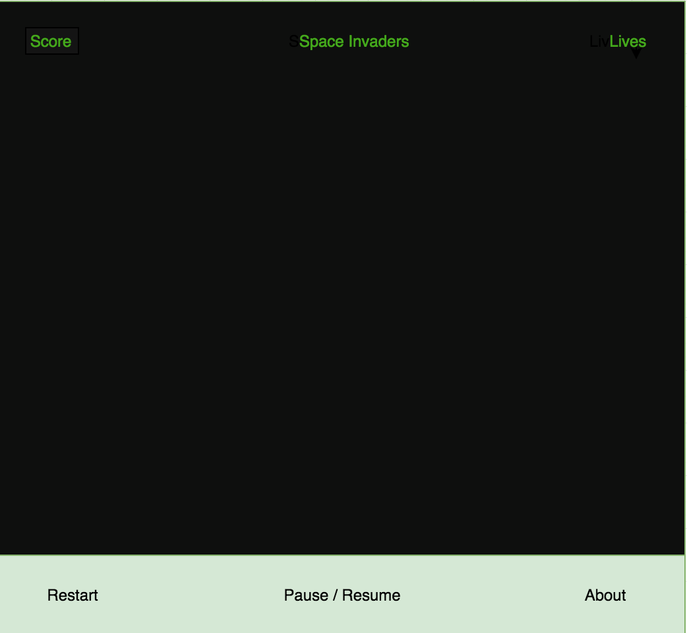

## Space Invaders

### Background

Space Invaders is a well-known classic arcade game. The goal of the game is to defend against the hostile army of alien invaders by shooting them with your spaceship. The player starts the game with three lives, but gains a life at the end of each level. This rendition will be written in Javascript. Enjoy!

### Functionality and MVP (Minimum Viable Product)

In this rendition of Space Invaders, users will be able to:

- [ ] Start, pause, reset the game, and mute the music/sound
- [ ] Move the spaceship around with arrow keys, and shoot at space invaders.
- [ ] Be shot and killed by space invaders, losing a life.
- [ ] Space Invaders move faster every time one of them dies.
- [ ] Gain a life after finishing a level

This project will also include:

- [ ] An 'About' modal describing the rules of the game/instructions
- [ ] A production ReadMe

### Wireframes

This app will will consist of a single screen with the game board, game controls and nav links to the Github and 'About' modal. Game controls will include Start, Pause, and Reset buttons.

### Architecture & Technologies

This project will be implemented with the following technologies:

- Vanilla Javascript and jQuery
- Webpack
- HTML Canvas

There will be six scripts involved in this project:

'board.js': this script will handle the logic for creating and updating the 'space-invaders' elements and rendering them to the DOM.

'game.js': this script will handle the behind the scenes game logic. Player score, remaining lives, etc. The game will have four states:
- Welcome screen
- Play screen
- Pause (The pause screen will be 'pushed' on top of the current screen)
- Lose screen

'moving_object.js': this script will hold the base logic of a moving object. All moving objects(ships, bullets) will inherit from this class.

'ship.js': this script is the blueprint of all ships, both human players and computer 'space-invaders'. A ship object will hold a 'type' (Defender(user), Grunt, Soldier, Invader and UFO).

'bullet.js': this simple script will hold all information about the bullet.

'shield.js': this script will hold the information of the shields the user may hide behind, as well as the logic for taking damage from each bullet, both player and computer bullets.

### Implementation Timeline

**Day 1**: Setup all of the essential Node modules. Create 'webpack.config.js' and 'package.json'. Write an entry file, and bare bones of the scripts written above. Create the welcome, pause, restart and lose states. Will use images for ships and use the Canvas 'drawImage' method to render the ship/bullet images onto the Canvas screen. Goals for the day:

- [ ] Create all of the essential states.
- [x] Create and render the shields and user ship on the canvas

**Day 2**: Create the bullet class and connect it to the ship class, allowing ships to fire at will. Add key listeners to the defender ship, allowing the user to move the ship sideways and fire bullets at the enemy. Object movement will be implemented by manipulating the object's [x,y] axis position on the canvas. (eg. User ship will move sideways, so its x-axis position must move up/down). Goals for the day:

- [x] Create and render bullets
- [x] Allow ships to fire bullets
- [ ] Add logic to handle deterioration of shields on impact with a bullet.
- [x] Add key listeners for 'defender' ship so users may control the movement.

**Day 3**: Build the logic for enemy ships, having them fire at random, reversing the x-axis direction when the enemy ships reach the end bounds of the board, and moving down one grid and continuing the cycle. Also increment the movement speed of enemy invaders as the herd thins out. Goals for the day:

- [x] Create and render enemy ships on canvas.
- [x] Allow enemy ships to move and fire bullets.
- [ ] Space Invaders move faster with each one you kill.

**Day 4**: Add music and sounds (Refer to synth). Add mystery UFO and styling to your product, so that it looks polished and professional.

- [ ] Add sound effects to bullets being fired, bullets on impact, and music.
- [ ] Create mystery UFO
- [ ] Add sufficient styling to product

### Bonus
- [ ] Power up items drop if player manages to shoot an enemy bullet
- [ ] Add mystery UFO that shows up every once in a while that shoots an array of bullets
- [ ] Add Boss at level 5 and 10
- [ ] Multiplayer
